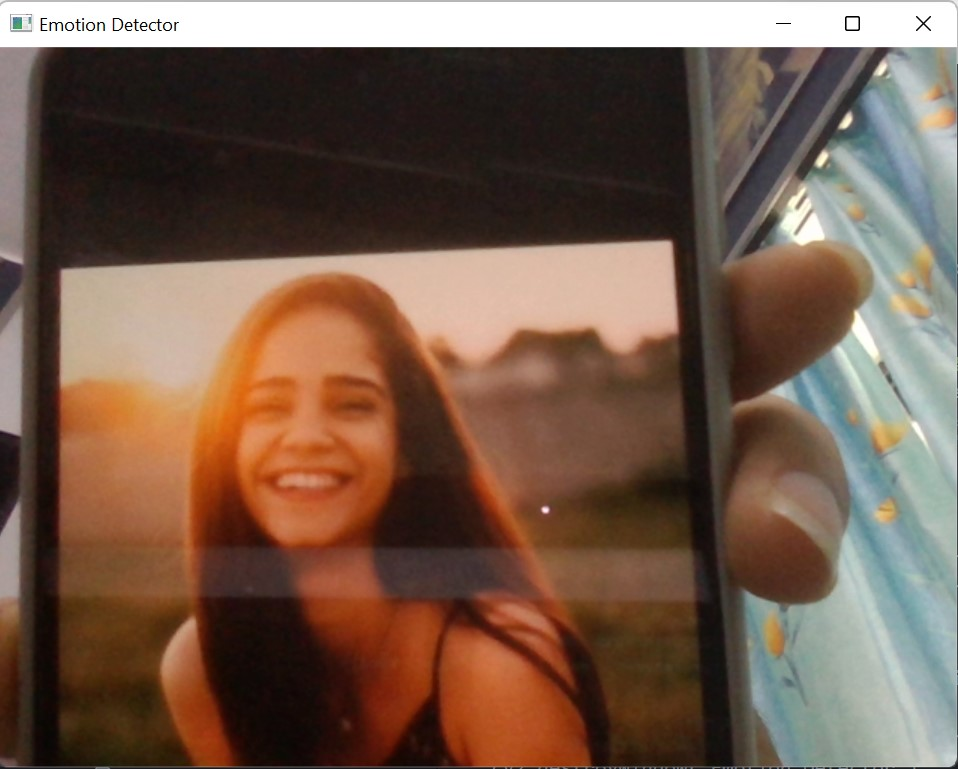
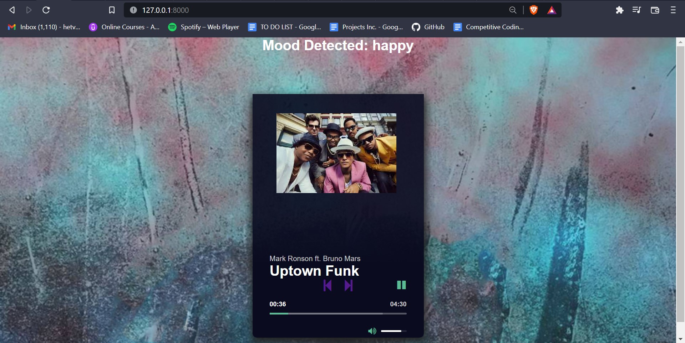

<h1 align="center">
  FaceTunes
 </h1><br>
 
# Problem Statement

Not always sure what music to listen to?<br>
This app recognizes ones emotion and mood based on facial expression. Based on the mood detected, a playlist is seleted and the songs are played on a music player.
Django framework is used in this web application. 

# Features

1. The app opens to a page which asks you to click a picture. 
2. The picture is tested and the mood is recognized based on facial expressions. 
3. A music player opens which plays music based on the the emotion/mood detected. 
4. If the picture fails to click on the site follow the following commands:

```bash

# Activate the Environment
$ source env/bin/activate

#go to webapp directory 
(env)$ cd webapp

#Run the clickPic file 
(env)$ clickPic.py

#Go back to the project directory
(env)$ cd ..

#Run Django web application
(env)$ python manage.py runserver


Navigate to [localhost](http://127.0.0.1:8000/)
```

# Pre-Requisites

> **Note**
>For Windows insallation only
<br>
To clone and run this application, you'll need [Git](https://git-scm.com) and python installed on your computer. From your command line:

```bash
# Clone this repository
$ git clone https://github.com/hetvigudka28/FaceTunes.git

# Create a Virtual Env
$ virtualenv2 --no-site-packages env

# Activate the Environment
$ source env/bin/activate

# Install cmake
$ pip install cmake

# Install Dlib
$ pip install dlib

#Dlib package is present in the repository
$ pip install https://github.com/hetvigudka28/FaceTunes/blob/master/dlib-19.19.0-cp38-cp38-win_amd64.wh

# Install all other Requirements
$pip install requirements.txt
```

# Run Django

```bash
# Activate the Environment
$ source env/bin/activate

# Change Directory to Project folder
(env)$ cd FaceTunes

#Run Django Server on localhost
(env)$ python manage.py runserver

Navigate to [localhost](http://127.0.0.1:8000/)
```

# Tech Stack

This software uses the following open source packages:

- [Django](https://www.djangoproject.com/)
- Python
- [Dlib](http://dlib.net/)
- [TensorFlow](https://www.tensorflow.org/)
- HTML
- CSS
- Javascript
- SQL


## Screenshots

<h2>Taking image and detecting emotion</h2>


  
<h2>Playlist played on music player based on mood</h2>



---

> GitHub [Hetvi Gudka](https://github.com/hetvigudka28)&nbsp;&middot;&nbsp;
> Linkedin [Hetvi Gudka](https://www.linkedin.com/in/hetvi-gudka/)

